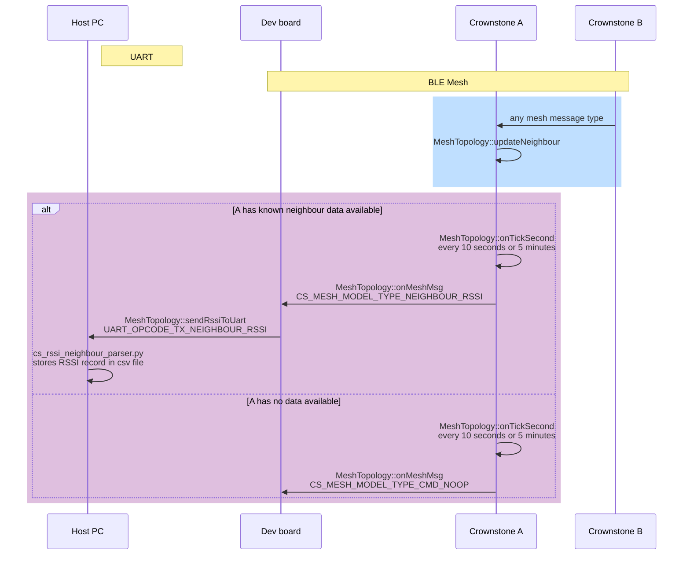

To log RSSI values for research purposes, use the cs_rssi_neighbour_parser.py and cs_rssi_extract_features.py scripts in the `crownstone_devtools/rssi` folder of this repository.

If you are interested in higher frequency data, check the configuration parameters of `inlude/localisation/cs_MeshTopology.h` in the bluenet firmware.

Dataflow is as indicated in the following sequence diagram.

